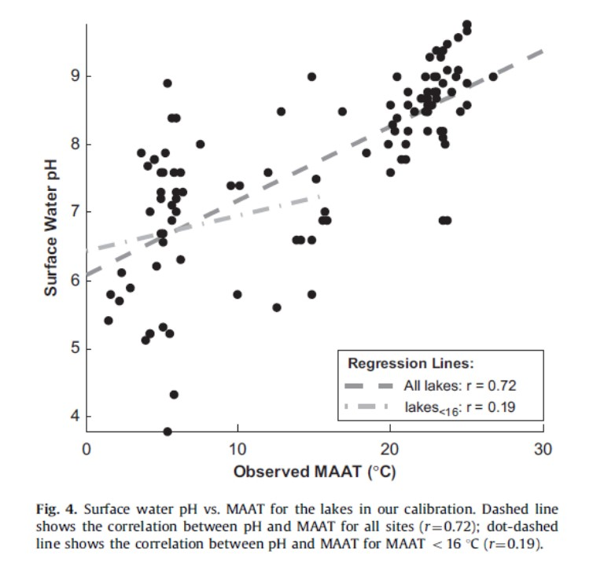

```{r setup, include=FALSE}
knitr::opts_chunk$set(echo = TRUE)
knitr::opts_chunk$set(
    fig.path = "img/"
)
```

## Description

Branched glycerol dialkyl glycerol tetraethers (brGDGTs) are environmental proxies recoverable from soils and sediments that allow for climatic recontruction of paleoenvironments. The paper I have selected (Loomis et al. 2012) looks at different calibration curves for calibrating brGDGT data to mean annual air temperature (MAAT). The different calibration curves put forward and tested in this study are based on different linear regressions related to brGDGT types: methylation (MBT) index, cyclization (CBT) index, relative abundance of non-cycliized brGDGTs (MbrGDGTs), and a best subsets regression (BSR) of the nine most common brGDGTs.

Loomis et al. used a dataset collected by a previous set of researchers, and added to it to create a total dataset of 111 East African lakes. The goal of this study was to determine the best calibration curve to predict MAAT for lacustrian sediments in when looking at East African lake locations.  


##Setting up my data for replication

I downloaded my dataset from the supplementary information appendix to my selected paper and combined pieces of three tables that contained the information I would be needing for this data replication assignment. I saved this combined datasheet on my computer as a .csv file. The authors of my paper state that they did not use outliers (defined as values that were three or more standard deviations away from the mean of any given dataset) for their calibrations. The values that were considered to be outliers were marked in the supplementary info, and I changed those values to "NA" to prevent their being incorporated into my calibrations. 

Additionally, portions of the data referenced in the paper are missing from the supplememtary info dataset (Loomis-collected data for Depth, MAAT, SW_T, BW_T, SW_pH and BWpH). As a result I had to add the missing data to my dataset from spreadsheets compiled by my supervisor. Some data are still missing. I beieve the added data obtained from my supervisor is accurate, but cannot be certain it is the exact data that was used by the authors as it was omitted from the supplementary info. 

I uploaded the my compiled .csv file using the below code: 

```{r}
d<- "C:/Users/keena/Documents/R/Projects/Loomis2012_suppinf_Data-rep-anal.csv"
Loomis<- read.table(d, header=TRUE, sep=",", stringsAsFactors = FALSE)
head(Loomis)
```

```{r}
names(Loomis)
```

I created a series of functions I could use to begin data replication. Though the dataset included their calculated MBT and CBT indexes, I decided to recalculate them myself as part of my replication.

```{r}
#function replicating Weijers equation for MBT index
MBT<- function(data) {
  (data$I+data$Ib+data$Ic)/(data$I+data$Ib+data$Ic+data$II+data$IIb+data$IIc+data$III+data$IIIb+data$IIIc)
}

#function replicating Weijers equation for CBT index
CBT<- function(data) {
  -log10((data$Ib+data$IIb)/(data$I+data$II))
}
```


```{r}
names(Loomis)
```

I then created a series of separate data frames containg the data that I would need to run my reanalysis

```{r}
Lakes<- data.frame(Loomis$Lake) #List of Lakes
MAAT<- data.frame((Loomis$MAAT)) #mean annual air temperature as provided by dataset
SWph<- data.frame(Loomis$SW.pH) #surface water temperature as provided by dataset 
methyl<-data.frame(MBT(Loomis)) # my recalculation of MBT index from Wiejers equation
cyc<- data.frame(CBT(Loomis)) # my recalculation of CBT index from Wiejers equation
Mbr<- data.frame(Loomis$MbrGDGTs.MAAT) # Major branched GDGTs calibration (equation not provided in paper) from dataset
MBTCBT<- data.frame(Loomis$MBT.CBT.MAAT) # ratio of MBT:CBT from dataset
output<- cbind(Lakes,methyl,cyc,Mbr,MBTCBT,MAAT,SWph) #creation of my new dataset for regressions and analyses

I<- data.frame(Loomis$I)
Ib<- data.frame(Loomis$Ib)
Ic<- data.frame(Loomis$Ic)
II<- data.frame(Loomis$II)
IIb<- data.frame(Loomis$IIb)
IIc<- data.frame(Loomis$IIc)
III<- data.frame(Loomis$III)
IIIb<- data.frame(Loomis$IIIb)
IIIc<- data.frame(Loomis$IIIc)
frac.abund<- cbind(MAAT, I, Ib, Ic, II, IIb, IIc, III, IIIb, IIIc) #creation of dataset containing only fractional abundances
```


```{r}
names(output)
```
Following these steps, I am now able to proceed with my data reanalysis using my new "output" data frame.

## Replication of Figure 4

Figure 4 from my paper shows a scatterplot of Surface Water pH as a function of Observed MAAT in degrees Celcius. Within this scatterplot are two linear regressions. The first is a regression fro data covering all of the lakes in the study, and the second is a regresion covering only the lakes with MAAT less than 16 degrees Celcius. 

I first ran a linear regression for All Lakes

```{r}
# linear regression of surface water pH as a function of MAAT for all lakes
fig4lm<- lm(Loomis.SW.pH~X.Loomis.MAAT., data=output)
summary(fig4lm)
```

I next ran a linear regression for Lakes less than 16 degrees Celcius

```{r}
# linear regression of surface water pH as a function of MAAT for lakes<16 degrees C
library(dplyr)
lake16<- filter(Loomis, MAAT < 16)
fig416<- lm(SW.pH~MAAT, data=lake16)
summary(fig416)
```
Finally I calculated the correlation coefficients for both All Lakes and Lakes<16""

```{r}
corcoAll<- cor(output$Loomis.SW.pH, output$X.Loomis.MAAT., method="pearson")
corcoAll
corco16<- cor(lake16$SW.pH, lake16$MAAT, method="pearson")
corco16
```


I then created Figure 4 by plotting both of the regressions: 

```{r}
#Reproduction of Figure 4 from Loomis et al. 2012
fig4<- plot(data=output, Loomis.SW.pH~X.Loomis.MAAT., xlab= "Observed MAAT(C)", ylab="Surface Water pH", main="Reproduction of Fig 4", pch=18)
fig4<- fig4+abline(fig4lm, col="red", lty = 4)
fig4<- fig4+abline(fig416, col="purple", lty = 1)
legend("bottomright", inset=.02, lty = c(4,1),
   c("All Lakes","Lakes<16"), col= c("red", "purple"), cex=0.8)
```

Visually my table aligns with the one in Loomis et al., with data points appearing to match and with the slopes of the respective regression lines agreeing with the figure in the paper (the paper does not report the actual value of the slope and intercept of the regression lines). 

```{r}

```


The r-value of the Lakes<16 reported in the paper is r=0.19, and my Lakes<16 r-value is r=0.1926442. The r-value of for All Lakes in the paper is r=0.72, while my replication gives a value of r=0.7226992. These both match the correlation coefficients stated in the paper. 


## Replication of Table 1

Table 1 in my paper shows the correlation coefficients and p-values for the fractional abundances of each type of brGDGT (i.e., I, II, IIc etc.) and MAAT, SW_pH, and Depth (of the lake). Part (a) shows these values for All Lakes and part (b) shows these values for Lakes<16. 

```{r}
names(Loomis)
```

For clarity, I split Table 1a and Table 1b into two separate analyses. I replicated Table 1a first: 

```{r}
I<- cor(Loomis$I,Loomis$MAAT, method = "pearson")
Ib<- cor(Loomis$Ib,Loomis$MAAT, method = "pearson")
Ic<- cor(Loomis$Ic,Loomis$MAAT, method = "pearson")
II<- cor(Loomis$II,Loomis$MAAT, method = "pearson")
IIb<- cor(Loomis$IIb,Loomis$MAAT, method = "pearson")
IIc<- cor(Loomis$IIc,Loomis$MAAT, method = "pearson")
III<- cor(Loomis$III,Loomis$MAAT, method = "pearson")
IIIb<- cor(Loomis$IIIb,Loomis$MAAT, method = "pearson")
IIIc<- cor(Loomis$IIIc,Loomis$MAAT, method = "pearson")
corMAAT<-cbind(I, Ib, Ic, II, IIb, IIc, III, IIIb, IIIc)

I<- lm(I~MAAT, data= Loomis)
I<- summary(I)$coefficients[2,4]
Ib<- lm(Ib~MAAT, data= Loomis)
Ib<- summary(Ib)$coefficients[2,4]
Ic<- lm(Ic~MAAT, data= Loomis)
Ic<- summary(Ic)$coefficients[2,4]
II<- lm(II~MAAT, data= Loomis)
II<- summary(II)$coefficients[2,4]
IIb<- lm(IIb~MAAT, data= Loomis)
IIb<- summary(IIb)$coefficients[2,4]
IIc<- lm(IIc~MAAT, data= Loomis)
IIc<- summary(IIc)$coefficients[2,4]
III<- lm(III~MAAT, data= Loomis)
III<- summary(III)$coefficients[2,4]
IIIb<- lm(IIIb~MAAT, data= Loomis)
IIIb<- summary(IIIb)$coefficients[2,4]
IIIc<- lm(IIIc~MAAT, data= Loomis)
IIIc<- summary(IIIc)$coefficients[2,4]
pMAAT<- cbind(I, Ib, Ic, II, IIb, IIc, III, IIIb, IIIc)

I<- cor(Loomis$I,Loomis$SW.pH, method = "pearson")
Ib<- cor(Loomis$Ib,Loomis$SW.pH, method = "pearson")
Ic<- cor(Loomis$Ic,Loomis$SW.pH, method = "pearson")
II<- cor(Loomis$II,Loomis$SW.pH, method = "pearson")
IIb<- cor(Loomis$IIb,Loomis$SW.pH, method = "pearson")
IIc<- cor(Loomis$IIc,Loomis$SW.pH, method = "pearson")
III<- cor(Loomis$III,Loomis$SW.pH, method = "pearson")
IIIb<- cor(Loomis$IIIb,Loomis$SW.pH, method = "pearson")
IIIc<- cor(Loomis$IIIc,Loomis$SW.pH, method = "pearson")
corSWpH<-cbind(I, Ib, Ic, II, IIb, IIc, III, IIIb, IIIc)

I<- lm(I~SW.pH, data= Loomis)
I<- summary(I)$coefficients[2,4]
Ib<- lm(Ib~SW.pH, data= Loomis)
Ib<- summary(Ib)$coefficients[2,4]
Ic<- lm(Ic~SW.pH, data= Loomis)
Ic<- summary(Ic)$coefficients[2,4]
II<- lm(II~SW.pH, data= Loomis)
II<- summary(II)$coefficients[2,4]
IIb<- lm(IIb~SW.pH, data= Loomis)
IIb<- summary(IIb)$coefficients[2,4]
IIc<- lm(IIc~SW.pH, data= Loomis)
IIc<- summary(IIc)$coefficients[2,4]
III<- lm(III~SW.pH, data= Loomis)
III<- summary(III)$coefficients[2,4]
IIIb<- lm(IIIb~SW.pH, data= Loomis)
IIIb<- summary(IIIb)$coefficients[2,4]
IIIc<- lm(IIIc~SW.pH, data= Loomis)
IIIc<- summary(IIIc)$coefficients[2,4]
pSWpH<- cbind(I, Ib, Ic, II, IIb, IIc, III, IIIb, IIIc)

I<- cor(Loomis$I,Loomis$Depth, method = "pearson")
Ib<- cor(Loomis$Ib,Loomis$Depth, method = "pearson")
Ic<- cor(Loomis$Ic,Loomis$Depth, method = "pearson")
II<- cor(Loomis$II,Loomis$Depth, method = "pearson")
IIb<- cor(Loomis$IIb,Loomis$Depth, method = "pearson")
IIc<- cor(Loomis$IIc,Loomis$Depth, method = "pearson")
III<- cor(Loomis$III,Loomis$Depth, method = "pearson")
IIIb<- cor(Loomis$IIIb,Loomis$Depth, method = "pearson")
IIIc<- cor(Loomis$IIIc,Loomis$Depth, method = "pearson")
corDepth<-cbind(I, Ib, Ic, II, IIb, IIc, III, IIIb, IIIc)

I<- lm(I~Depth, data= Loomis)
I<- summary(I)$coefficients[2,4]
Ib<- lm(Ib~Depth, data= Loomis)
Ib<- summary(Ib)$coefficients[2,4]
Ic<- lm(Ic~Depth, data= Loomis)
Ic<- summary(Ic)$coefficients[2,4]
II<- lm(II~Depth, data= Loomis)
II<- summary(II)$coefficients[2,4]
IIb<- lm(IIb~Depth, data= Loomis)
IIb<- summary(IIb)$coefficients[2,4]
IIc<- lm(IIc~Depth, data= Loomis)
IIc<- summary(IIc)$coefficients[2,4]
III<- lm(III~Depth, data= Loomis)
III<- summary(III)$coefficients[2,4]
IIIb<- lm(IIIb~Depth, data= Loomis)
IIIb<- summary(IIIb)$coefficients[2,4]
IIIc<- lm(IIIc~Depth, data= Loomis)
IIIc<- summary(IIIc)$coefficients[2,4]
pDepth<- cbind(I, Ib, Ic, II, IIb, IIc, III, IIIb, IIIc)

Table1a<- data.frame(rbind(corMAAT, pMAAT, corSWpH, pSWpH, corDepth, pDepth))
library(data.table)
setattr(Table1a, "row.names", c("MAAT", "MAAT p-value", "SW pH", "SW pH p-value", "Depth", "Depth p-value"))
Table1a
```

The correlation coefficients in my reanalysis for each of the fractional abundancies of each type of brGDGT match those provided in the paper. Some (but not all) of my p-values, however, are very slightly different (e.g. my p-value for I~Depth = 0.3222219 when the paper's is 0.318). All of the differences are minute, and the significance of the different analyses does not change. 

I then replicated Table 1b, which runs the same analysis as Table 1a, but using only Lakes<16:

```{r}
I<- cor(lake16$I,lake16$MAAT, method = "pearson")
Ib<- cor(lake16$Ib,lake16$MAAT, method = "pearson")
Ic<- cor(lake16$Ic,lake16$MAAT, method = "pearson")
II<- cor(lake16$II,lake16$MAAT, method = "pearson")
IIb<- cor(lake16$IIb,lake16$MAAT, method = "pearson")
IIc<- cor(lake16$IIc,lake16$MAAT, method = "pearson")
III<- cor(lake16$III,lake16$MAAT, method = "pearson")
IIIb<- cor(lake16$IIIb,lake16$MAAT, method = "pearson")
IIIc<- cor(lake16$IIIc,lake16$MAAT, method = "pearson")
corMAAT16<-cbind(I, Ib, Ic, II, IIb, IIc, III, IIIb, IIIc)

I<- lm(I~MAAT, data= lake16)
I<- summary(I)$coefficients[2,4]
Ib<- lm(Ib~MAAT, data= lake16)
Ib<- summary(Ib)$coefficients[2,4]
Ic<- lm(Ic~MAAT, data= lake16)
Ic<- summary(Ic)$coefficients[2,4]
II<- lm(II~MAAT, data= lake16)
II<- summary(II)$coefficients[2,4]
IIb<- lm(IIb~MAAT, data= lake16)
IIb<- summary(IIb)$coefficients[2,4]
IIc<- lm(IIc~MAAT, data= lake16)
IIc<- summary(IIc)$coefficients[2,4]
III<- lm(III~MAAT, data= lake16)
III<- summary(III)$coefficients[2,4]
IIIb<- lm(IIIb~MAAT, data= lake16)
IIIb<- summary(IIIb)$coefficients[2,4]
IIIc<- lm(IIIc~MAAT, data= lake16)
IIIc<- summary(IIIc)$coefficients[2,4]
pMAAT16<- cbind(I, Ib, Ic, II, IIb, IIc, III, IIIb, IIIc)

I<- cor(lake16$I,lake16$SW.pH, method = "pearson")
Ib<- cor(lake16$Ib,lake16$SW.pH, method = "pearson")
Ic<- cor(lake16$Ic,lake16$SW.pH, method = "pearson")
II<- cor(lake16$II,lake16$SW.pH, method = "pearson")
IIb<- cor(lake16$IIb,lake16$SW.pH, method = "pearson")
IIc<- cor(lake16$IIc,lake16$SW.pH, method = "pearson")
III<- cor(lake16$III,lake16$SW.pH, method = "pearson")
IIIb<- cor(lake16$IIIb,lake16$SW.pH, method = "pearson")
IIIc<- cor(lake16$IIIc,lake16$SW.pH, method = "pearson")
corSWpH16<-cbind(I, Ib, Ic, II, IIb, IIc, III, IIIb, IIIc)

I<- lm(I~SW.pH, data= lake16)
I<- summary(I)$coefficients[2,4]
Ib<- lm(Ib~SW.pH, data= lake16)
Ib<- summary(Ib)$coefficients[2,4]
Ic<- lm(Ic~SW.pH, data= lake16)
Ic<- summary(Ic)$coefficients[2,4]
II<- lm(II~SW.pH, data= lake16)
II<- summary(II)$coefficients[2,4]
IIb<- lm(IIb~SW.pH, data= lake16)
IIb<- summary(IIb)$coefficients[2,4]
IIc<- lm(IIc~SW.pH, data= lake16)
IIc<- summary(IIc)$coefficients[2,4]
III<- lm(III~SW.pH, data= lake16)
III<- summary(III)$coefficients[2,4]
IIIb<- lm(IIIb~SW.pH, data= lake16)
IIIb<- summary(IIIb)$coefficients[2,4]
IIIc<- lm(IIIc~SW.pH, data= lake16)
IIIc<- summary(IIIc)$coefficients[2,4]
pSWpH16<- cbind(I, Ib, Ic, II, IIb, IIc, III, IIIb, IIIc)

I<- cor(lake16$I,lake16$Depth, method = "pearson")
Ib<- cor(lake16$Ib,lake16$Depth, method = "pearson")
Ic<- cor(lake16$Ic,lake16$Depth, method = "pearson")
II<- cor(lake16$II,lake16$Depth, method = "pearson")
IIb<- cor(lake16$IIb,lake16$Depth, method = "pearson")
IIc<- cor(lake16$IIc,lake16$Depth, method = "pearson")
III<- cor(lake16$III,lake16$Depth, method = "pearson")
IIIb<- cor(lake16$IIIb,lake16$Depth, method = "pearson")
IIIc<- cor(lake16$IIIc,lake16$Depth, method = "pearson")
corDepth16<-cbind(I, Ib, Ic, II, IIb, IIc, III, IIIb, IIIc)

I<- lm(I~Depth, data= lake16)
I<- summary(I)$coefficients[2,4]
Ib<- lm(Ib~Depth, data= lake16)
Ib<- summary(Ib)$coefficients[2,4]
Ic<- lm(Ic~Depth, data= lake16)
Ic<- summary(Ic)$coefficients[2,4]
II<- lm(II~Depth, data= lake16)
II<- summary(II)$coefficients[2,4]
IIb<- lm(IIb~Depth, data= lake16)
IIb<- summary(IIb)$coefficients[2,4]
IIc<- lm(IIc~Depth, data= lake16)
IIc<- summary(IIc)$coefficients[2,4]
III<- lm(III~Depth, data= lake16)
III<- summary(III)$coefficients[2,4]
IIIb<- lm(IIIb~Depth, data= lake16)
IIIb<- summary(IIIb)$coefficients[2,4]
IIIc<- lm(IIIc~Depth, data= lake16)
IIIc<- summary(IIIc)$coefficients[2,4]
pDepth16<- cbind(I, Ib, Ic, II, IIb, IIc, III, IIIb, IIIc)

Table1b<- data.frame(rbind(corMAAT16, pMAAT16, corSWpH16, pSWpH16, corDepth16, pDepth16))
library(data.table)
setattr(Table1b, "row.names", c("MAAT", "MAAT p-value", "SW pH", "SW pH p-value", "Depth", "Depth p-value"))
Table1b
```

For Table 1b the correlation coefficients in my reanalyisis are, like the p-values for Table 1a sometimes in line with the paper, and sometimes are slightly off from the values given in the paper (e.g. for II MAAT, my r-value is 0.17557412 while the r-value from the paper is 0.15). The p-values in my reanalysis do not match those from the paper, though how far they diverge from the values in the paper vary. As a rule, my values are not very far off from those of the paper, with the largest difference being 0.07. The differences do not alter the significance of the p-values. 


##Reproducing Stepwise Forward Selection (SFS) Calibration

The authors are seeking to improve predictions of MAAT based on fractional abundances of brGDGTs from East African lakes. To this end they introduce a new calibration calculated using stepwise forward selection (SFS), a type of stepwise regression. To do this they take their highest correlation for all lakes (III and MAAT = 0.89) and use it as their starting value. They then add other fractional abundancies to the linear regression model to see if it improves the corelation coefficient. If it does it stays, if it doesn't it is removed. 

I will replicate the calculation of this SFS calibration below.

I'm starting by loading some necessary packages and selecting the same fractional abundance (III) as the authors of my paper did, because it is has the highest correlation to MAAT (-0.8907375 in my calculations). For this I will use my frac.abund dataset.

```{r}
names(frac.abund)
```

```{r}
library(tidyverse)
library(caret)
library(leaps)
library(MASS)

#Set up my stepwise model to identify the best model with the lowest RMSE
train.control<- trainControl(method = "cv", number=10)
step.model<- train(X.Loomis.MAAT.~., data= frac.abund, method = "leapForward", tuneGrid= data.frame(nvmax= 1:9), trControl = train.control)
step.model$results
```

I can visually pick out the best model (the one with the lowest RMSE), but the following code highlights it for me:

```{r}
step.model$bestTune
```

This shows that the fifth model is the best model. To identify the variables that produced this model I input the following code: 

```{r}
summary(step.model$finalModel)
```

The asterisks indicate which variables are included in my best fit model: Ib, Ic, IIc, III. Thus, the best regression is MAAT~Ib+Ic+IIc+III.

To get the coefficients that correspond to this function I input the following code: 

```{r}
SFS<- lm(X.Loomis.MAAT.~Loomis.III+Loomis.Ib+Loomis.Ic+Loomis.IIc, data= frac.abund)
SFS
```

This gives a final equation of:

MAAT = 16.89 - 32.87(III) + 178.35(Ic) - 470.29(IIc) + 78.25(Ib)

This does not match the calibration given in the paper, which is: 

MAAT = 22.77 - 33.58(III) - 12.88(II) - 418.53(IIc) + 86.43(Ib)

The equations are similar, but the differ in that mine includes Ic as a part of the calibration in place of II in theirs. 

As an experiment I ran the a model using the same variables as the paper, and though the numbers are similar, they still are not identical to those given by the authors:

```{r}
SFS<- lm(X.Loomis.MAAT.~Loomis.III+Loomis.II+Loomis.IIc+Loomis.Ib, data= frac.abund)
SFS
```

I checked to see if this disparity was due to a failure to properly remove outliers from my dataset, as the paper had stated calibrations did not include outliers. I edited my original .csv file to remove all such values and imported it as a new dataset: 

```{r}
d<- "C:/Users/keena/Documents/R/Projects/Loomis2012_suppinf_Data-rep-anal_NA.csv"
outliers<- read.table(d, header=TRUE, sep=",", stringsAsFactors = FALSE)
head(outliers)
```

I then ran the same SFS process using this new dataset:

```{r}
#Set up my stepwise model to identify the best model with the lowest RMSE
train.control2<- trainControl(method = "cv", number=10)
step.model2<- train(MAAT~., data= outliers, method = "leapForward", tuneGrid= data.frame(nvmax= 1:9), trControl = train.control)
step.model2$results
```

```{r}
step.model$bestTune
```

```{r}
summary(step.model$finalModel)
```

This gives our variables as Ib, Ic, IIc, and III, which is the same as I got in my original effort. 

The coefficients for this are: 

```{r}
SFS2<- lm(MAAT~III+Ib+Ic+IIc, data= outliers)
SFS2
```

WIth the equation of:

MAAT = 16.51 - 31.59(III) + 99.35(Ic) 1 475.72(IIc) + 92.57(Ib)

as opposed to 

MAAT = 22.77 - 33.58(III) - 12.88(II) - 418.53(IIc) + 86.43(Ib) 

from the paper and 

MAAT = 16.89 - 32.87(III) + 178.35(Ic) - 470.29(IIc) + 78.25(Ib)

from my first SFS equation. 


Checking the variables selected in the paper using the new "outliers" database gives the following coefficients:

```{r}
SFS2<- lm(MAAT~III+II+IIc+Ib, data= outliers)
SFS2
```

Which also don't align with the coefficients given in the paper. 


